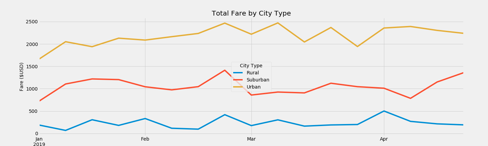

# PyBer Analysis Report

## Background and Results

### Purpose

This is a summary DataFrame of the key metrics for the ride-sharing data by city type which includes a multiple-line graph that shows the total fares for each week by each city type. A report of the analysis is shown below.

### Technical Analysis

The analyis was carried out in Python 3.7.6 using Jupyter Notebook 6.0.3 (Windows 7 Home Edition).

### Results

The summary table of ride-sharing data by city type is shown below. It shows the average fare per ride and average fare per driver for each city type.

This plot shows the total fare by city type per week, from January 2019 to April 2019.

### Summary

Urban cities have a higher number of rides and drivers. However, the average fare per ride and average fare per driver are the lowest among other city types. A higher number
On the other hand, rural tities show the lowest number of total rides and drivers, and unlike the urban cities, the average fare per ride and average fare per driver are the highest. This results could be linked to the distance per ride. Rides in rural cities could cover longer distances and because of that, the fares per ride and driver are higher. In urban cities, distances between the start and the end of the ride might be shorter.

## Challenges Encountered and Overcome

### Challenges and Difficulties Encountered

* Programming
  The programming was challenging in the following aspects: chain functions. A quick guide for chain functions might be needed for anyone doing this analysis from scratch.
  
* Data analysis
  The data analysis was fairly easy.

* Graphing, etc
  The graphing was challenging in the following aspects: Accessing the properties or attributes of object oriented plotting. A quick guide or cheat-sheet might be needed for quick reference.

### Technical Analyses Used

  I basically used Google to find the information I needed to overcome the programming and graphing challenges mentioned above.

## Recommendations and Next Steps

  I recommend the future person that continues this analyis to avoid refrain from using Google to find the information you need for programming. There are very few persons who can remmeber all the code options necessary for every analysis. I also recommend making cheat-sheets for easy access to such programming tips.

### Recommendations for Future Analysis

### Additional Analysis 1

* Description of Approach
  Analysing the distance covered per ride might give another dimension to the analysis and clarify even more the differences between city types.

* Technical Steps
  Use Python 3.7.6 and Jupyter Notebook 6.0.3 to open the notebook file and continue the analysis using the file PyBer.ipynb. Use statistical packages such as numpy, scipy.stats, pandas, and matplotlib.pyplot. Merge the distance data to the merged dataframe and generate plots to compare distance per rides and per city type.
  
### Additional Analysis 2

* Description of Approach.
    Analysing the weather conditions and the time during the day (day time fare? night time fare?) per ride might give even more dimensions to the analysis and clarify in detail the differences between city types.

* Technical Steps
  Use Python 3.7.6 and Jupyter Notebook 6.0.3 to open the notebook file and continue the analysis using the file PyBer.ipynb. Use statistical packages such as numpy, scipy.stats, pandas, and matplotlib.pyplot. Merge the weather and the day-time/night-time fare data to the merged dataframe and generate plots to compare distance per rides and per city type.
